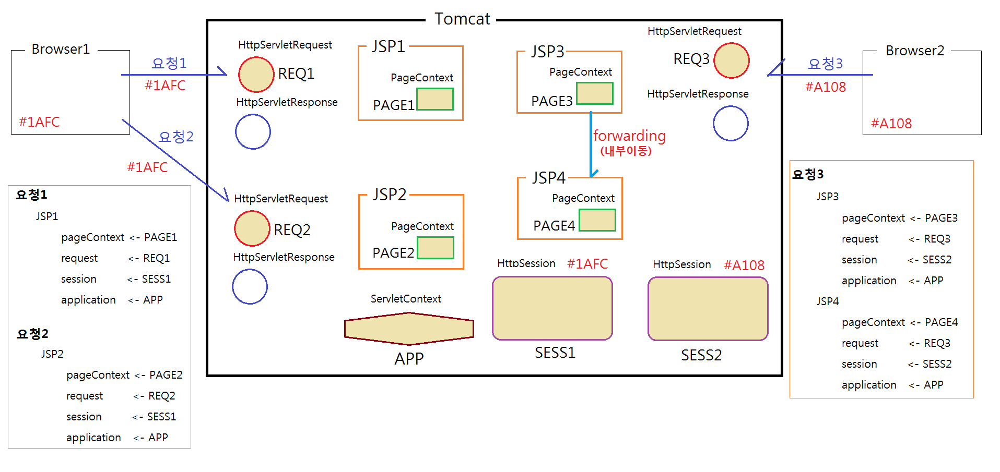

# JSP의 속성과 스코프
## 속성
- 속성은 객체(값)다.
- 속성은 뷰에 표현할 정보다.
- JSP는 속성(값, 객체)을 저장할 수 있는 4종류의 객체를 제공한다.

| 객체 | 범위 | 속성 |
| --- | --- | --- |
| PageContext | 페이지 | 객체 |
| HttpServletRequest | 요청 | 객체 |
| HttpSession | 세션 | 객체 |
| ServletContext | 애플리케이션 | 객체 |

- 속성관련 API
  - 속성의 저장 : void setAttribute(String name, Object value) 
  - 속성의 조회 : Object getAttribute(String name)
  - 속성의 삭제 : void removeAttribute(String name)
## 스코프
- **속성(값, 객체)를 공유할 수 있는 유효범위**를 말한다.
  - 속성(값, 객체)을 위의 4 종류 객체 중 어디에 저장하느냐에 따라서 **저장된 속성(값, 객체)에 대한 이용범위 혹은 생존시간이 달라진다**.
  - 이것을 **스코프**라고 한다.
	- 스코프의 종류
		- Page Scope
			- PageContext에 저장되는 속성이 가지는 유효범위다.
			- 같은 JSP내에서만 속성을 공유할 수 있다.
		- **Request Scope**
			- HttpServletRequest에 저장되는 속성이 가지는 유효범위다.
			- 클라이언트의 요청을 처리하는 동안 속성을 공유할 수 있다.
			- foward, include 방식을 사용하는 경우 여러 jsp 페이지에서 요청객체에 저장된 속성을 공유할 수 있다.
			- Model2개발방식에서는 Model이 획득한 데이터를 View에 전달할 때 주로 사용되는 유효범위다.
			- 클라이언트의 요청 처리가 완료되면(응답이 완료되면)  요청객체가 소멸되기 때문에 저장된 속성도 사라진다.
			- 속성에 대한 관리가 필요없다.(메모리 문제를 신경쓸 필요없다.)
		- Session Scope
			- HttpSession에 저장되는 속성이 가지는 유효범위다.
			- 세션객체가 유지되는 동안은 세션객체에 저장된 속성(값, 객체)은 서로 다른 JSP 페이지에서도 공유할 수 있다.
			- 세션객체가 만료되는 순간(로그아웃, 브라우저를 닫는 경우) 저장된 속성도 사라진다.
			- 세션객체는 브라우저마다(클라이언트)마다 하나씩 생성되는  객체이기 때문에, 세션에 속성(값, 객체)으로 저장되는 것은 해당 클라이언트만 사용할 수 있다.
			- 세션객체 속성으로 저장되는 것들은 "개인적인 정보"만 저장된다.
		- Application Scope
			- ServletContext에 저장되는 속성이 가지는 유효범위다.
			- 웹서버가 실행되는 동안(웹 애플리케이션이 실행되는 동안)  ServletContext객체에 저장된 속성(값, 객체)은 모든 JSP, 모든 서블릿, 모든 필터, 모든 사용자가 공유할 수 있다. 
			
- 속성과 스코프의 관계

```
홍길동이 브라우저1을 사용하고 있다.
- 브라우저1은 SESS1 세션객체의 세션아이디를 가지고 있다.
- 요청1(JSP1의 실행을 요청하는 요청)이 처리되고 있는 동안
	- REQ1과 응답객체가 생성됨
	- JSP1의 _jspService(request, response)가 실행됨
		- JSP의 내장객체가 모두 준비됨
		  * pageContext <- PAGE1
		  * request <- REQ1
		  * response <- 응답객체
		  * session <- SESS1
		  * application <- APP
		- JSP1 스크립틀릿, 표현식에서는 
		  * PAGE1, REQ1, SESS1, APP에 속성(값 혹은객체)를 저장하거나, 저장된 속성(값 혹은 객체)를 사용할 수 있다.
	- 요청1에 대한 응답이 완료됨
		- _jspService(request, response)가 종료됨
		   * PAGE1객체 소멸
		- REQ1, 응답객체 소멸
		- SESS1과 APP는 계속 유지됨
		   * JSP1에서 SESS1과 APP에 속성(값, 객체)를 저장했다면 다른 JSP에서 사용할 수 있음
	 

김유신이 브라우저2를 사용하고 있다.
- 브라우저2는 SESS2 세션객체의 세션아이디를 가지고 있다.
- 요청3(JSP3의 실행을 요청하는 요청)이 처리되고 있는 동안
	- REQ3과 응답객체가 생성됨
	- JSP3의 _jspService(request, response)가 실행됨
	  * pageContext <- PAGE3
	  * request <- REQ3
	  * response <- 응답객체
 	  * session <- SESS2
	  * application <- APP
	- JSP3 스크립틀릿, 표현식에서는
	  * PAGE3, REQ3, SESS2, APP에 속성 저장, 속성 사용 가능
	- JSP4로 내부이동이 발생함.
	  * JSP3의 _jspService(request, response)가 종료됨
	    * PAGE3은 소멸됨
	- JSP4의 _jspService(request, response)가 실행됨
	  * pageContext <- PAGE4
	  * request <- REQ3 (JSP3가 사용했던 요청객체다)
	  * response <- 응답객체 (JSP3가 사용했던 요청객체다)
 	  * session <- SESS2
	  * application <- APP
	- JSP4 스크립틀릿, 표현식에서는
	  * PAGE4, REQ3, 응답객체, SESS2, APP에 속성 저장, 속성 사용 가능
	  * REQ3를 JSP3와 JSP4가 같이 사용하게 됨
	  * JSP3에서 REQ3에 속성(값 혹은 객체)을 저장했다면, JSP4에서 사용 가능
   	  * 즉, 다른 JSP에게 업무로직 수행결과로 획득된 데이터를 전달하는게 가능해짐
	  * 데이터 전달에 세션이나 애플리케이션 객체를 사용하지 않는 이유는 세션객체나 애플리케이션 객체는
            계속 유지되는 객체이기 때문에 그 객체에 저장된 데이터도 계속 유지됨(메모리 부족 문제가 발생할 수 있기 때문)
	  * 그에 비해 요청객체는 응답이 완료되면 즉시 사라지는 객체이기 때문에 
            다른 JSP에 값을 전달하기 위해서 요청객체를 사용하면 JSP에서 값 사용해서 표현하고 응답을 제공하고 나면
            요청객체도 사라지고, 요청객체에 저장된 데이터도 사라짐(메모리 부족 문제가 발생하지 않음)
```


## Redirect와 Forward
- Redirect
  - void response.sendRedirect(String url)
    - 지정된 url을 재요청하라는 응답을 클라이언트에게 보낸다.

- Forward
  - RequestDispatcher객체가 제공하는 메소드를 활용해서 포워드 방식의 내부이동이 가능하다.
  - RequestDispatcher request.getRequestDispatcher(String path) 지정된 경로로 클라이언트의 요청을 보내는 RequestDispatcher객체를 반환한다.
  - RequestDispatcher의 주요 메소드
    - void forward(ServletRequest req, ServletResponse resp)
      - RequestDispatcher객체에 지정된 경로로 내부이동한다. 내부이동 대상 JSP/서블릿에 요청객체와 응답객체를 전달해서 공유한다.
    - void include(ServletRequest req, ServletResponse resp)
      - 응답에 지정된 경로의 JSP를 포함시킨다. 
		 


		
		 
